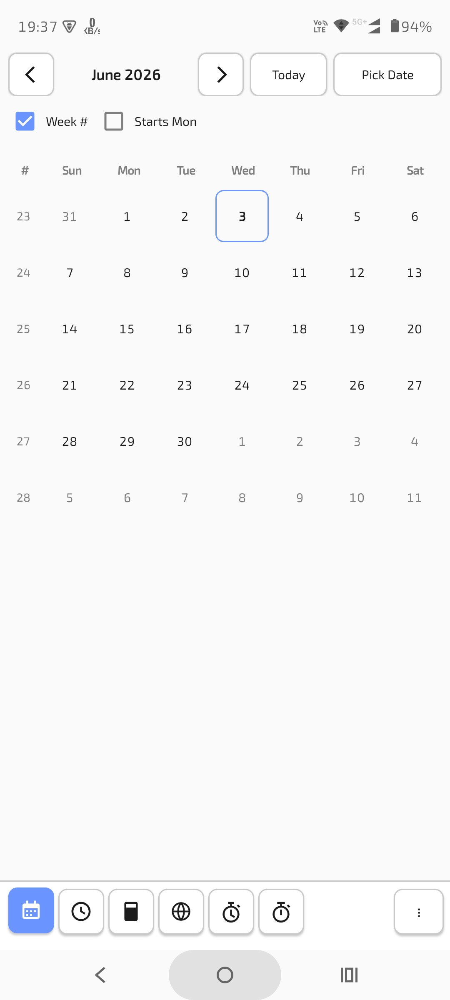
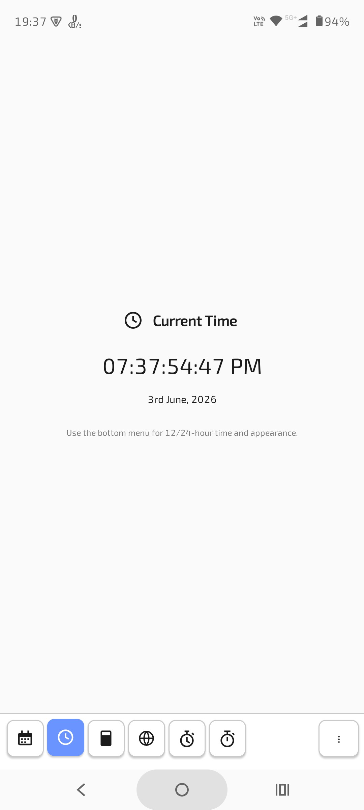
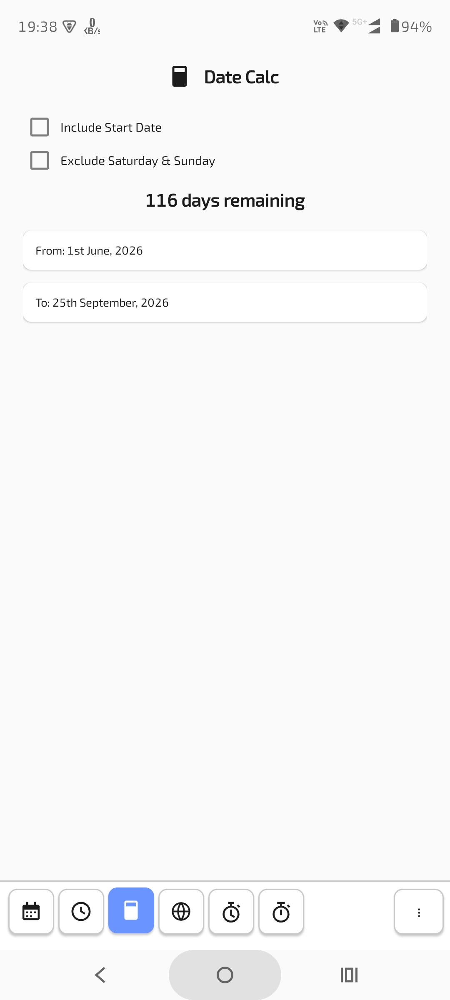
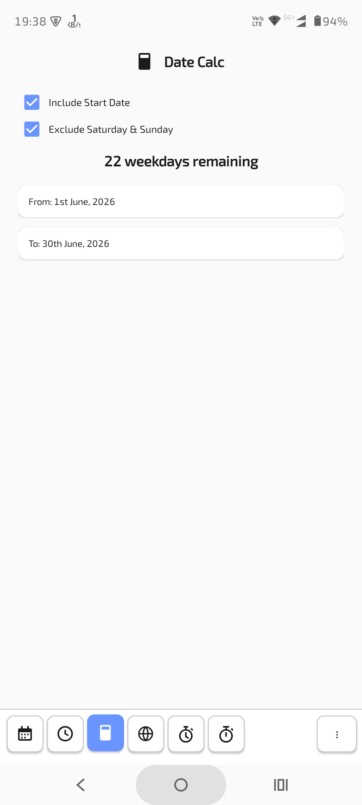
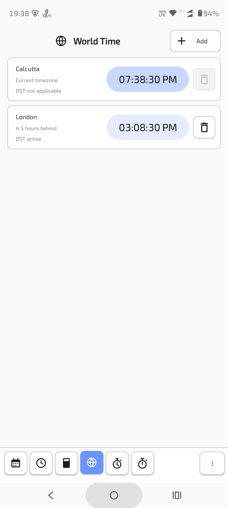
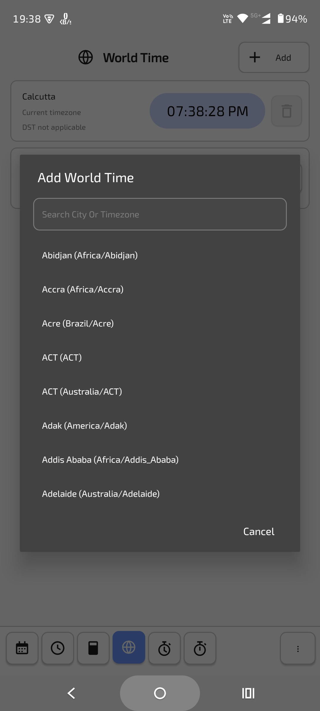
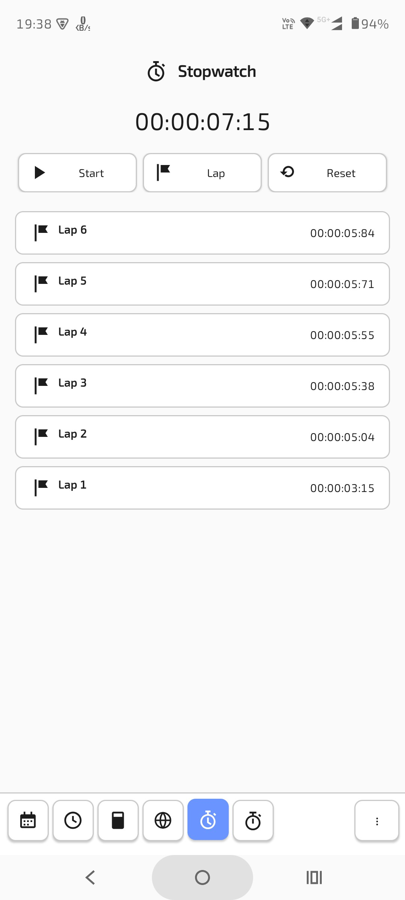
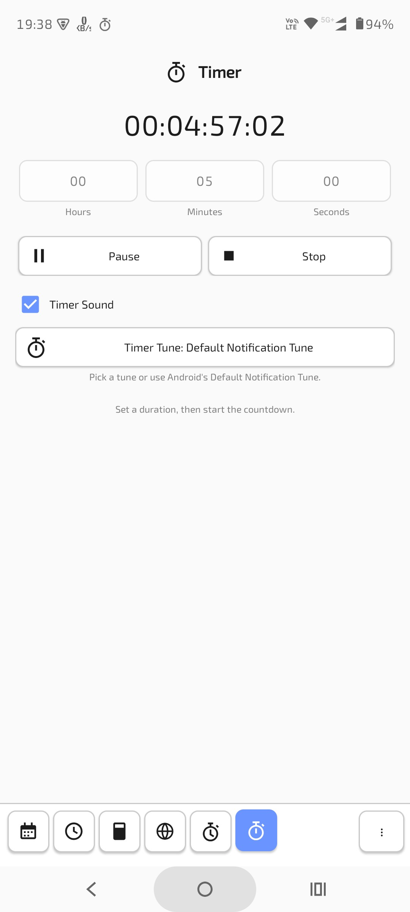
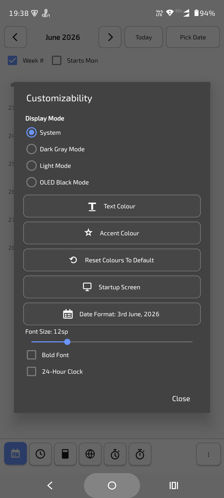

# Jiffy

Jiffy is a small, offline Android calendar and time utility.

It combines a simple calendar, a clock, a date calculator, world time, a stopwatch, and a timer in one lightweight app. The goal is not to replace a full calendar suite with accounts, sync, reminders, or online holiday feeds. Jiffy is intentionally local, direct, and calm: open it, check a date or time, count days, time something, and move on.

Package name:

```text
com.souravgoswami.jiffy
```

Current version:

```text
0.0.1
```

Author:

```text
Sourav Goswami
```

License:

```text
GNU General Public License v3.0
```

## Screenshots

Add screenshots to the repository and update these placeholders as needed.

### Calendar



### Clock



### Date Calc




### World Time




### Stopwatch



### Timer



### Customizability



## What Jiffy Does

Jiffy is made of six main modes:

- Calendar
- Clock
- Date Calc
- World Time
- Stopwatch
- Timer

The bottom tab bar lets you move between modes quickly. On small screens, the tabs become more compact and may hide text so the UI still fits.

## Calendar

The calendar is deliberately simple. It shows one month at a time, lets you move between months, and lets you highlight a single date.

Calendar features:

- Highlight one selected day at a time.
- Tap a different day to move the highlight.
- Navigate months with chevron buttons.
- Swipe between months.
- Jump directly to a picked date.
- Return to today.
- Show week numbers.
- Choose whether weeks start on Sunday or Monday.
- Long-press dates to open date counting tools.

Jiffy does not include holidays. Earlier versions experimented with offline holiday data, but the feature was removed to keep the app reliable, predictable, and simple. Holidays can be checked in a dedicated calendar app or online source.

## Date Calc

Date Calc counts the distance between two dates.

It can answer questions like:

- How many days remain until a date?
- How many days ago was a date?
- How many weekdays are between two dates?
- What is the date distance between an arbitrary From and To date?

Date Calc features:

- Pick From and To dates.
- Long-press a date in the calendar to open the calculator with that range.
- Include the start date if desired.
- Exclude Saturday and Sunday if desired.
- Use the configured date format where possible.

Example:

```text
From: Wednesday, 3rd June, 2026
To: Friday, 25th December, 2026

205 days remaining
```

With "Include Start Date" enabled, the count includes the first selected date. With "Exclude Saturday & Sunday" enabled, weekends are skipped.

## Clock

The clock shows the current local time with centisecond display in the main clock view.

Clock features:

- 12-hour format.
- 24-hour format.
- Configurable date format.
- Current date shown below the clock.
- Appearance controlled by the app customizability settings.

Example 12-hour format:

```text
09:15:03:78 AM
```

Example 24-hour format:

```text
21:15:03:78
```

## World Time

World Time shows the current time in multiple time zones.

World Time features:

- The first row is always the device's current time zone.
- The current time zone row cannot be deleted.
- Additional world times can be added by the user.
- Search is available when adding a world time.
- Time zone offsets include daylight saving time where applicable.
- If DST is not applicable, Jiffy says so.
- World times include seconds.
- 12-hour and 24-hour display follows the app clock setting.

The app uses Android's built-in time zone database, so it works offline while still respecting the time zone rules available on the device.

## Stopwatch

The stopwatch supports normal stopwatch actions and keeps running in the background with a foreground-service notification. It is designed as a high reliability stopwatch mode: elapsed time is calculated from a stored real-clock anchor instead of depending on UI tick speed.

Stopwatch features:

- Start/Stop toggle button with matching icons.
- Lap.
- Reset.
- Reset confirmation dialog.
- Lap list.
- Lap rows with lap icons.
- State persistence across rotation and ordinary app recreation.
- Real-clock elapsed calculation with stored timezone/UTC-offset metadata.
- Timezone and DST offset correction while running.
- Same-zone wall-clock jump correction against elapsed realtime while running.
- Foreground notification while the stopwatch is running.
- Notification actions for Lap and Stop.

The notification intentionally does not include Reset. Reset stays inside the app because it clears elapsed time and laps, so Jiffy asks for confirmation first.

On Android 13 and newer, Jiffy asks for notification permission so the stopwatch notification and its actions can appear in the normal notification drawer. Android does not strictly require notification permission to start a foreground service, but without it the foreground-service notice may only appear in the system task manager area instead of the notification shade.

## Timer

The timer is a simple countdown tool with local persistence and a foreground notification while it is running. It is designed as a high reliability timer mode: remaining time is calculated from a stored real-clock resume anchor, so slow UI refreshes do not make the countdown drift.

Timer features:

- Set hours, minutes, and seconds.
- Show remaining time with centisecond precision.
- Start/Pause toggle button with matching icons.
- Stop a countdown and return it to the selected duration.
- Reset button state after a countdown finishes.
- Persist timer state across rotation and ordinary app recreation.
- Real-clock countdown calculation with stored timezone/UTC-offset metadata.
- Timezone and DST offset correction while running.
- Same-zone wall-clock jump correction against elapsed realtime while running.
- Foreground notification while the timer is running.
- Notification actions for Pause and Stop.
- Optional finish sound, controlled from the Timer screen.
- Default Notification Tune when sound is enabled.
- Pick a custom timer tune with Android's notification sound picker.

The timer notification intentionally keeps the action set small. Pause freezes the remaining time, while Stop ends the active countdown and restores the timer to its selected duration.

When Timer Sound is enabled, Jiffy posts a timer-finished notification using the selected tune. By default, this is Android's Default Notification Tune. The tune can be picked from the Timer screen using Android's built-in notification sound picker. When Timer Sound is disabled, Jiffy uses a silent timer-finished notification instead.

The Timer Sound option is disabled when Android notification permission is not available. The timer tune picker is disabled when Timer Sound is off or notification permission is not available, because timer tunes are delivered through Android notification channels.

Android notification-channel sounds are fixed after channel creation, so Jiffy creates a timer-finished notification channel for the selected tune. The selected tune can still be managed from Android's notification settings.

On Android 13 and newer, Jiffy uses the same notification permission for both stopwatch and timer foreground notifications.

## Customizability

Jiffy has a customizability dialog in the bottom menu.

Display modes:

- System
- Dark Gray Mode
- Light Mode
- OLED Black Mode

Colour and font options:

- Text Colour
- Accent Colour
- Reset Colours To Default
- Font Size
- Bold Font

Clock and startup options:

- 24-Hour Clock
- Startup Screen
- Date Format

Default accent colour:

```text
#6a94ff
```

The dark theme uses a bluish dark palette. OLED Black Mode keeps the background black for OLED-friendly use.

## Date Formats

Jiffy supports several date formats, including friendly ordinal formats and numeric formats.

Examples:

```text
3rd June, 2026
Wednesday, 3rd June, 2026
June 3rd, 2026
Wednesday, June 3rd, 2026
03/06/2026
06/03/2026
2026-06-03
```

The default format is:

```text
3rd June, 2026
```

## Bottom Menu

The bottom-right menu contains app-level actions.

Menu items:

- Customizability
- About Jiffy
- Exit

Customizability includes display mode, colours, font size, clock format, startup screen, and date format. About Jiffy shows the app icon, the version string, author information, and a short description of what the app does.

## Offline Design

Jiffy is designed to work offline.

It does not require accounts, sync, holiday APIs, network calls, or cloud services. World Time uses Android's local time zone rules. Calendar, Date Calc, Clock, Stopwatch, and Timer are all local device features.

## Privacy

Jiffy is intentionally private by design.

Current privacy characteristics:

- No account login.
- No analytics.
- No ads.
- No network permission.
- No calendar account access.
- No location permission.
- No contacts permission.
- App backup is disabled in the manifest.

Permissions currently used:

- `POST_NOTIFICATIONS`: used on Android 13+ so stopwatch, timer, and timer-finished notifications can appear normally.
- `FOREGROUND_SERVICE`: required for Android foreground services.
- `FOREGROUND_SERVICE_SPECIAL_USE`: used for the running stopwatch and timer foreground services.

## Foreground Service Declaration

Jiffy uses `foregroundServiceType="specialUse"` only for user-started Stopwatch and Timer sessions. These services are not used for analytics, background sync, location tracking, media playback, ads, or data collection.

Android's standard foreground-service types do not map cleanly to a general-purpose stopwatch or countdown timer that can keep running while the app is backgrounded. Jiffy therefore declares the special-use subtype in `AndroidManifest.xml` for each foreground service:

- Stopwatch: user-initiated stopwatch timing. Keeps elapsed-time tracking and notification controls available while Jiffy is backgrounded, until the user stops the stopwatch.
- Timer: user-initiated countdown timing. Keeps remaining-time tracking, pause/stop controls, and timer-completion handling available while Jiffy is backgrounded.

Suggested Play Console declaration text:

```text
Jiffy uses the special-use foreground service type for user-initiated stopwatch and countdown timer sessions. The service starts only after the user starts a stopwatch or timer, keeps timing accurate while the app is backgrounded, and exposes notification controls for stopwatch start/stop/lap actions and timer pause/stop actions. The foreground service ends when the user stops/resets the session or when the timer is completed and dismissed. Jiffy does not use this service for background sync, location, analytics, ads, or data collection.
```

## Technical Overview

Jiffy is a native Android app written in Java.

Project details:

- Android application module: `app`
- Android Gradle Plugin: `8.7.3`
- Compile SDK: `35`
- Target SDK: `35`
- Minimum SDK: `26`
- Java language level: `17`
- Package: `com.souravgoswami.jiffy`
- Main activity: `MainActivity`
- Stopwatch foreground service: `StopwatchForegroundService`
- Timer foreground service: `TimerForegroundService`
- Timer finish alert helper: `TimerAlert`

The project currently does not use external app dependencies.

## Build Requirements

You need:

- Linux, macOS, or another environment with a POSIX shell for `build.sh`.
- OpenJDK 17 or newer.
- `keytool`, which is included with the JDK.
- Gradle installed and available as `gradle`.
- Android SDK installed.
- Android SDK Platform 35 installed.
- Android build tools compatible with Android Gradle Plugin 8.7.3.
- Optional: Android Studio.
- Optional: `adb` for installing/testing APKs on a device or emulator.

This project does not currently include a Gradle wrapper. Use the system `gradle` command.

If Gradle cannot find your Android SDK, create or update `local.properties`:

```properties
sdk.dir=/path/to/Android/Sdk
```

Example Linux SDK path:

```properties
sdk.dir=/home/your-user/Android/Sdk
```

## Build A Debug APK

Debug builds use the normal Android debug signing key.

```sh
$ gradle --no-daemon assembleDebug
```

The debug APK is generated under:

```text
app/build/outputs/apk/debug/
```

Install it with `adb`:

```sh
$ adb install -r app/build/outputs/apk/debug/app-debug.apk
```

## Release Signing

Android release builds should be signed before distribution.

The Gradle release signing config reads these environment variables:

```text
JIFFY_KEYSTORE
JIFFY_STORE_PASSWORD
JIFFY_KEY_ALIAS
JIFFY_KEY_PASSWORD
```

If `JIFFY_KEYSTORE` is not set, Gradle can still build an unsigned release APK. This is useful for open-source contributors and CI checks, but APKs intended for distribution must be signed.

## Generate A Release Keystore

For your own release builds, generate your own keystore. Do not reuse someone else's release key.

Example:

```sh
$ keytool -genkeypair \
  -v \
  -keystore ./jiffy-release.jks \
  -alias jiffy \
  -keyalg RSA \
  -keysize 4096 \
  -validity 10000
```

`keytool` will ask for passwords and certificate identity fields.

You can also provide passwords directly for local testing:

```sh
$ keytool -genkeypair \
  -v \
  -keystore ./jiffy-release.jks \
  -storepass example_password_123 \
  -keypass example_password_123 \
  -alias jiffy \
  -keyalg RSA \
  -keysize 4096 \
  -validity 10000 \
  -dname "CN=Jiffy, OU=Android, O=Jiffy, L=Kolkata, ST=West Bengal, C=IN"
```

The password above is only an example. Do not use it for a real release key.

## Inspect A Keystore

List information about the generated key:

```sh
$ keytool -list \
  -keystore ./jiffy-release.jks \
  -storepass example_password_123 \
  -alias jiffy
```

Verbose listing:

```sh
$ keytool -list \
  -v \
  -keystore ./jiffy-release.jks \
  -storepass example_password_123 \
  -alias jiffy
```

## Build A Signed Release APK With build.sh

The included `build.sh` expects:

- A keystore at `./jiffy-release.jks`
- Alias `jiffy`
- Gradle available as `gradle`

Run:

```sh
$ ./build.sh
```

The script asks for:

```text
Keystore password:
Key password:
```

Then it runs:

```sh
$ gradle --no-daemon clean assembleRelease
```

The release APK is generated under:

```text
app/build/outputs/apk/release/
```

## Build A Signed Release APK Manually

You can skip `build.sh` and export the signing variables yourself:

```sh
$ export JIFFY_KEYSTORE="$PWD/jiffy-release.jks"
$ export JIFFY_KEY_ALIAS="jiffy"
$ export JIFFY_STORE_PASSWORD="example_password_123"
$ export JIFFY_KEY_PASSWORD="example_password_123"
$ gradle --no-daemon clean assembleRelease
```

Again, the example password is only a placeholder.

## Build An Unsigned Release APK

For open-source build verification, an unsigned release can be produced without signing variables:

```sh
$ gradle --no-daemon clean assembleRelease
```

If no release signing variables are set, the output metadata may show:

```text
app-release-unsigned.apk
```

That is expected for unsigned local builds.

## Useful Development Commands

Assemble debug:

```sh
$ gradle --no-daemon assembleDebug
```

Assemble release:

```sh
$ gradle --no-daemon assembleRelease
```

Clean:

```sh
$ gradle --no-daemon clean
```

Install debug APK:

```sh
$ adb install -r app/build/outputs/apk/debug/app-debug.apk
```

Launch Jiffy with `adb`:

```sh
$ adb shell am start -n com.souravgoswami.jiffy/.MainActivity
```

## Repository Layout

```text
.
|-- app/
|   |-- build.gradle
|   `-- src/main/
|       |-- AndroidManifest.xml
|       |-- java/com/souravgoswami/jiffy/
|       |   |-- MainActivity.java
|       |   |-- StopwatchForegroundService.java
|       |   |-- TimerForegroundService.java
|       |   `-- TimerAlert.java
|       `-- res/
|-- build.gradle
|-- build.sh
|-- gradle.properties
|-- settings.gradle
`-- README.md
```

## Contributing

Contributions are welcome.

Good areas for improvement:

- Accessibility refinements.
- More automated tests for date calculation and formatting.
- Better large-screen polish.
- Translation/localization.
- Packaging metadata for F-Droid or other distribution channels.

Please keep Jiffy's core values intact:

- Offline first.
- Simple UI.
- No accounts.
- No ads.
- No unnecessary permissions.
- No network dependency for core behavior.

## License

Jiffy is licensed under the GNU General Public License version 3.

In short: you may use, study, share, and modify the app under the terms of the GPL v3. If you distribute modified versions, you must provide the corresponding source code under the same license terms.

For publication, include a full `LICENSE` or `COPYING` file containing the complete GPL v3 license text.
